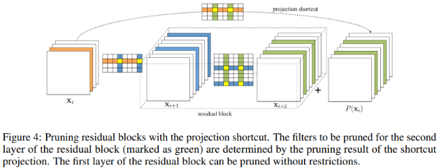
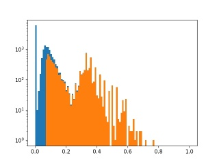
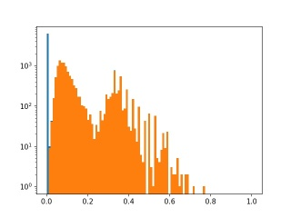
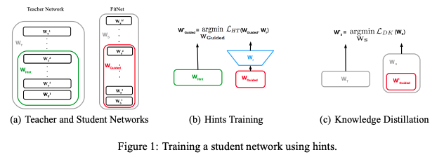
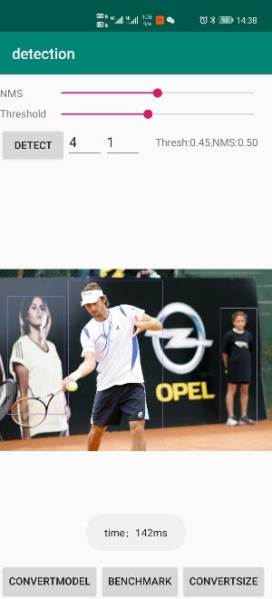

# mobile-yolov5-pruning-distillation
channel pruning and distillation for mobilev2-yolov5s. ultra light but better performence!<br>
TensorRT Version ===> [https://github.com/Syencil/tensorRT](https://github.com/Syencil/tensorRT)<br>
Android Version ===> [https://github.com/Syencil/ncnn-android-projects](https://github.com/Syencil/ncnn-android-projects)

## Background
yolov5s在640x640分辨率下的计算量和参数量分别为8.39G和7.07M。在速度上仍然有提升空间，通过替换backbone(mobilenetv2)，通道剪枝对模型进行压缩。
利用蒸馏提升小模型的精度。<br>
本项目以工程化为基础，主要是模型端的优化。实现了常用的剪枝和蒸馏算法，并对其做了一个简单的介绍和评估。通过在voc上实验来验证各个方法的有效性。
最后将工程可用模型转换成对应部署版本。

## Baseline
数据集采用Pascal VOC，trainset = train2007+train2012+val2007+val2012，testset = test2007，Baseline采用mobile-yolo（imagenet预训练），如果没有特别说明，第一个模块采用Focus <br>
如果未经特殊说明则均为使用默认参数，batchsize=24，epoch=50，train_size = 640，test_size = 640，conf_thres=0.001，iou_thres=0.6，mAP均为50<br>
PS. 由于资源有限，此项目只训练50个epoch，实际上可以通过调整学习率和迭代次数进一步提高mAP。但是可以通过控制相同的超参数来进行实验对比，所以并不影响最终结果。<br>

baseline由4个部分组成：yolov5s，官方提供的coco权重在voc上进行微调所以不具备可比性，但是可以作为蒸馏指导模型；mobilev2-yolo5s和mobilev2-yolo5l均是只更改了对应的backbone；mobilev2-yolo3则是用的yolo3head，结构同[https://github.com/Adamdad/keras-YOLOv3-mobilenet](https://github.com/Adamdad/keras-YOLOv3-mobilenet)
基本一致（keras的是mobilev1，参数量和计算量更大），此处作为参照物。

|Model|Precision|Recall|mAP|Params(M)|Flops(G)|
|----|----|----|----|----|----|
|yolo5l|0.659|0.881|0.862|49.90|57.52|
|yolo5s|0.536|0.863|0.809|7.07|8.39|
|mobilev2-yolo3|0.458|0.838|0.755|22.03|19.58|
|mobilev2-yolo5l|0.496|0.807|0.741|15.36|16.65|
|mobilev2-yolo5s|0.457|0.809|0.719|3.60|4.67|

由于yolo5s用了coco权重，实际上是不具备可比性的，然而我们可以利用他作为Teacher模型对小模型进行蒸馏。mobilev2-yolo3是验证github上[keras版本](https://github.com/Adamdad/keras-YOLOv3-mobilenet)
在此项目中的表现，忽略一些不同的超参选择，mAP在一个点之内是可以接受的。不过mobilev2-yolo3的参数量和计算量还是太大了（主要是head的branch），
于是用yolo5的head构建了mobilev2-yolo5l和mobilev2-yolo5s。可以看出随着参数量和计算量的下降，mAP也是在非线性下降。<br>
PS.实际上yolov5独有的focus模块表现并不好（在后文NCNN模块中提到），对精度基本上没有任何影响，反而略微还提升了模型计算量。

## Pruning
### Strategy 1
从baseline中可以看出mobilev2-yolo5s整体的计算量已经很少了，不过在追求高性能的路上还是有压缩的空间的。
我们选取mobilev2-yolo5s作为剪枝的基础模型。以以下策略为基础：
1. 输出层不动，统计其他所有BN层的weight分布
2. 根据稀疏率决定剪枝阈值
3. 开始剪枝，如果当前层所有值均小于阈值则保留最大的一个通道(保证结构不被破坏)



|Model|Precision|Recall|mAP|ex-epoch|sl|Prune_prob|Params(M)|Flops(G)|
|----|----|----|----|----|----|----|----|----|
|mobilev2-yolo5s|0.457|0.809|0.719|-|-|-|3.60|4.67|
|mobilev2-yolo5s|0.407|0.793|0.687|-|6e-4|-|3.60|4.67|
|pruning 1|0.427|0.695|0.604|10|6e-4|thres=0.01|2.69|3.79|
|pruning 2|0.384|0.821|0.699|20|6e-4|thres=0.01|2.69|3.79|
|pruning 3|0.337|0.704|0.555|20|6e-4|0.5|1.87|3.04|

1. 先从头训练一个baseline，以及训练一个对bn中gamma参数加入L1正则化的网络。稀疏参数为sl=6e-4。结果比baseline掉了3个点。
2. 剪枝策略按照论文中的做法给定一个稀疏率，统计所有参与剪枝层的bn参数l1值并进行排序，依据稀疏率确定阈值。
3. 将所有小于阈值的层全部减掉，如果有依赖则将依赖的对应部分也剪掉。如果一层中所有的层都需要被移除，那么就保留最大的一层通道(保证网络结构)
4. 不过还可以看出一个问题，就是选的0.5稀疏率太大了，把很多并不小的层都剪切掉了。说明我们对应当前sl训练出来的模型，使用0.5的稀疏率不够好，这次我们不按照稀疏率来剪枝，而是给定一个非常小的值0.01。
5. finetune 10个epoch。mAP是0.604掉点严重，不过注意到是用的cos学习率，在训练末期val acc还在上涨。为了验证是否是finetune训练次数不够，此时尝试训练20个epoch，map果然上升到0.699。
此时剪枝过后的mAP已经超过稀疏训练的baseline了。不过不排除是因为多训练了20个epoch的原因。<br>
  

## Distillation
### Introduction
 <br>
[蒸馏]((https://arxiv.org/pdf/2006.05525.pdf))是希望将T模型学习到的知识迁移到S模型中。通常蒸馏方式大体可以分为1）Response-based，2）Feature-based，3）Relation-based。
按照策略则可以分为1）online distillation，2）offline distillation和3）self distillation。按照蒸馏算法可以分为1）adversarial distillation，2）multi-teacher distillation，
3）cross-modal distillation，4）graph-based distillation，5）attention-based distillation，6）data-free distillation，7）quatized Distillation，8）lifelong distillation，
9）nas distillation。<br>


### Strategy 1
我们以mobilev2-yolo5s作为S-model，希望能将T-model在coco和voc上学习到的知识蒸馏到mobilev2-yolo5s中。以[Object detection at 200 Frames Per Second](https://arxiv.org/abs/1805.06361)为基础方法配置蒸馏损失函数，抑制背景框带来的类别不均衡问题。
用L2 loss作为蒸馏基础函数，损失中的蒸馏dist平衡系数选择为1。<br>

1. 选取基于darknet为backbone的yolo5s作为T模型。这样能尽可能的保证结构上的一致。而yolo5s的参数量和计算量差不多正好是mobilev2-yolo5s的两倍，
capacity gap并不是很明显。蒸馏后提了接近3个点。

|Model|Precision|Recall|mAP|
|----|----|----|----|
|T-yolo5s|0.536|0.863|0.809|
|mobilev2-yolo5s|0.457|0.809|0.719|
|S-mobilev2-yolo5s|0.296|0.876|0.746|

2. 选取yolo5l作为T模型，精度更高，但是gap更大（计算量相差14倍以上了）。可以看到蒸馏后提升很少，不到一个点。当然可以采用助教蒸馏的方式可以一定程度上弥补gap差距

|Model|Precision|Recall|mAP|
|----|----|----|----|
|T-yolo5l|0.659|0.881|0.862|
|mobilev2-yolo5s|0.457|0.809|0.719|
|S-mobilev2-yolo5s|0.233|0.879|0.724|

### Strategy 2
策略1仅仅只是蒸馏最后一个输出层，属于distillation中Response-Based。考虑到特征提取也是可以进行蒸馏的，提升backbone在特征提取上的表征能力。
对于T和S特征图之间维度存在不匹配的情况，我们首先应用一个Converter网络将通道数转换成相同的
这个思想在[FitNet](https://arxiv.org/pdf/1412.6550.pdf)上就提出过。<br>


1. 我们尝试将特征图和输出层一起作为蒸馏指导，dist参数为1.0。mAP和Strategy 1完全相同。

|Model|Precision|Recall|mAP|
|----|----|----|----|
|T-yolo5s|0.536|0.863|0.809|
|mobilev2-yolo5s|0.457|0.809|0.719|
|S-mobilev2-yolo5s|0.303|0.871|0.746|

## Quick Start
### Baseline
|Model|instruction|
|----|----|
|yolo5s|python3 train.py --type voc|
|mobilev2-yolo3|python3 train.py --type mvoc3|
|mobilev2-yolo5l|python3 train.py --type mvocl|
|mobilev2-yolo5s|python3 train.py --type mvocs|
### Pruning
|Model|instruction|
|----|----|
|sparse learning|python3 train.py --type smvocs|
|pruning|python3 pruning.py -t 0.1|
|finetune|python3 train.py --type fsmvocs|
### Distillation
|Model|instruction|
|----|----|
|strategy 1.1|python3 train.py --type dmvocs|
|strategy 1.2|python3 train.py --type dmvocs_l|
|strategy 2.1|python3 train.py --type dfmvocs|

### Test
```
export PYTHONPATH=$PWD
python3 test.py --weights 权重路径
```

## Inference with TensorRT
1. python3 model/onnx_export.py --weights weight_path
2. 参考[https://github.com/Syencil/tensorRT](https://github.com/Syencil/tensorRT)

## Inference with Ncnn
### Rethinking
1. 在将onnx转换为ncnn格式的时候，发现focus模块的slice无法直接转换。发现是step=2的原因。
针对这个问题，有3个方案：用4个原图叠加然后推理；用Conv代替Focus重新训一个；修改ncnn的代码迫使其支持step!=1的slice操作。
    - 在[https://github.com/sunnyden/YOLOV5_NCNN_Android/issues/2](https://github.com/sunnyden/YOLOV5_NCNN_Android/issues/2)中直接将4个原图叠在一起。这看起来很方便，实际上是将输入图像大小扩大了一倍。为了弥补计算量上的增多只能原图输入尺寸降成原来的一半，带来的就是精度的损失。
    - 如果在ncnn中实现的话，单纯实现step=2的Slice操作对性能影响很大（内存不连续）所以需要将整个focus模块拿出来实现，这样onnx的导出部分也得改.
    - 用Conv重新训练一个模型，从以上实验可以看出Conv替换Focus之后精度并没有任何变化（0.1这种算正常扰动），计算量和参数量反而小了。

|Model|Precision|Recall|mAP|Params(M)|Flops(G)|
|----|----|----|----|----|----|
|mobilev2-yolo3(conv)|0.462|0.838|0.756|22.03|19.32|
|mobilev2-yolo3(focus)|0.458|0.838|0.755|22.03|19.58|
|mobilev2-yolo5s(conv)|0.423|0.819|0.718|3.60|4.40|
|mobilev2-yolo5s(focus)|0.457|0.809|0.719|3.60|4.67|
|S-mobilev2-yolo5s(conv)|0.333|0.866|0.744|3.60|4.40|
|S-mobilev2-yolo5s(focus)|0.296|0.876|0.746|3.60|4.67|

其中focus代表第一个模块采用yolov5的focus模块，conv则是采用stride=2的3x3卷积作为第一个模块。
根据以上结论，我们采用重新训练了一个模型，并进行蒸馏得到S-mobilev2-yolo5s(conv)。利用onnx2ncnn将其转换并部署到android

2. TnesorRT中的tensor内存是连续模型，然而在ncnn中采用腾讯自己的mat格式，并不能保证channel之间的内存是连续性的。
这就导致无法按照之前tensorRT的后处理（BHWAC）来进行。在导出的时候尽量保证BCHW的格式，这样在ncnn中没有个channel中的值才是连续的、可解释的。

3. 有一个比较坑的点：由于用的是nn.Upsample进行上采样，在导出为onnx格式的时候，resize操作中只保存了输出outputsize而不是scale。
这导致在转ncnn的时候，将其转换为Interp操作的时候直接将outputsize固定了。然而Onnx和trt中输入是固定的，在ncnn中是动态尺寸输入，这就会导致m和l的输出大小永远不变。

4. 在实际应用中发现，如果只走arm cpu，在P40 pro上size=640分辨率下的mobilev2-yolo5s的FPS最高也就9（所有均算上了前后处理的时间）。
考虑640的输入大小计算量仍然太大，端上并不需要这么高的推理分辨率，故考虑size=320。此时发现推理FPS可以达到32，不过voc上mAP下降了2.7。

|Model|Precision|Recall|mAP|Params(M)|Flops(G)|
|----|----|----|----|----|----|
|mobilev2-yolo5s(640x640)|0.333|0.866|0.744|3.60|4.40|
|mobilev2-yolo5s(320x320)|0.334|0.811|0.717|3.60|1.10|

### Demon in Android
具体代码可以参考[android demon](https://github.com/Syencil/ncnn-android-projects)，以下为一些截图示例<br>
   

## Reference
1. [https://github.com/ultralytics/yolov5](https://github.com/ultralytics/yolov5)
2. [https://github.com/VainF/Torch-Pruning](https://github.com/VainF/Torch-Pruning)
3. [https://github.com/Syencil/tensorRT](https://github.com/Syencil/tensorRT)
4. [https://github.com/Syencil/ncnn-android-projects](https://github.com/Syencil/ncnn-android-projects)
